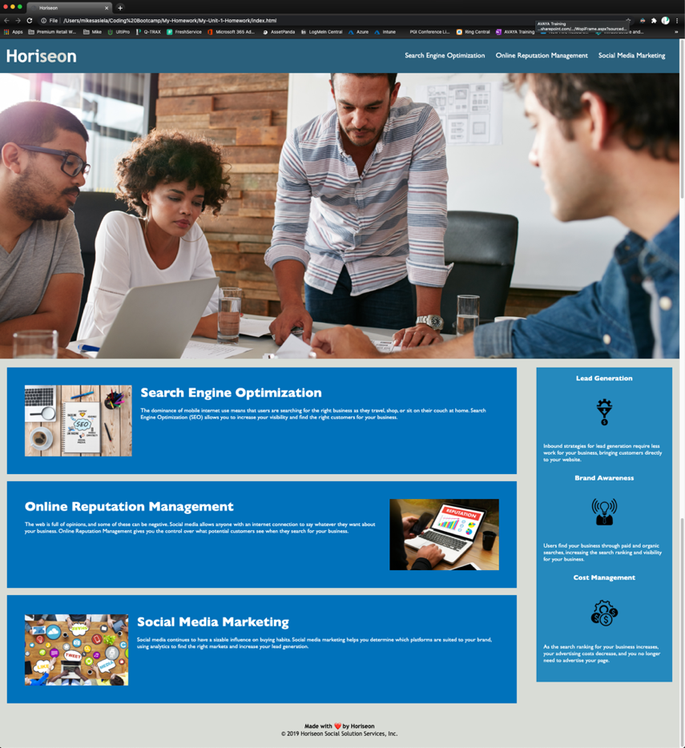

# Unit-1-Homework

## Completed Web Page

The following image shows the completed web application's appearance and functionality:

...

...

## Tasks to be Completed for Acceptance
...
GIVEN a webpage meets accessibility standards
WHEN I view the source code
THEN I find semantic HTML elements
WHEN I view the structure of the HTML elements
THEN I find that the elements follow a logical structure independent of styling and positioning
WHEN I view the image elements
THEN I find accessible alt attributes
WHEN I view the heading attributes
THEN they fall in sequential order
WHEN I view the title element
THEN I find a concise, descriptive title
...

## Steps to complete homework

### In HTML file

- Added comments to better describe and separate thoughts
- Added name of webpage to title tag
- Fixed Image tags
    - Links had incorrect endings
    - Added alt tags to all image tags
- Fixed "Search Engine Optimization link"
    - Added id tag to the div
    - Now properly jumps to correct section of page
- 
